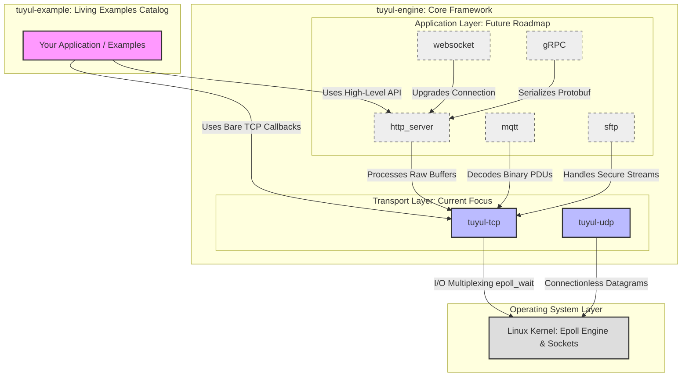

# tuyul-engine

`tuyul-engine` is a lightweight, low-latency, and high-performance asynchronous networking engine written from scratch in **Modern C++ (C++17)**. 

The main goal here is to build a rock-solid networking foundation that compiles with absolutely *zero external dependencies*. Inspired from `boost` but stripped down to be ultra-modular and easy to grasp.

---

## 🗺️ System Design

The infrastructure relies on **Event-Driven Reactor Pattern**. To get maximum performance on Linux, directly hook into the kernel's native **`epoll`** mechanism, combined with a strict zero-copy buffer strategy prevent hog RAM or CPU cycles.

---